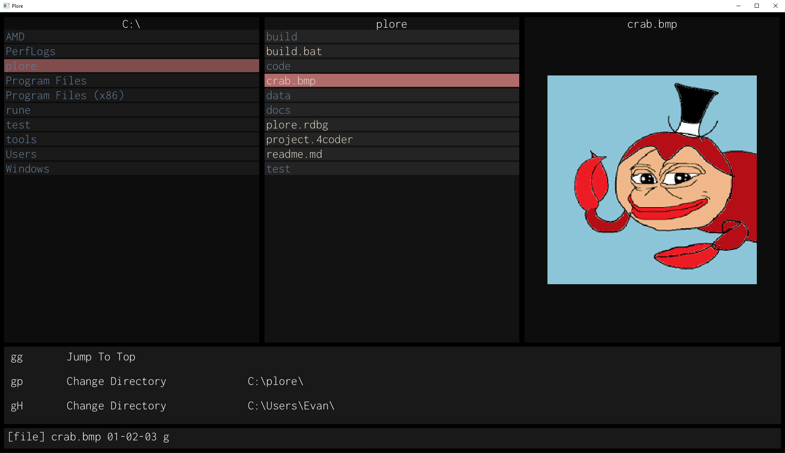

# plore
## Handmade, simple file explorer

Somewhat inspired by Ranger and LF, with a first-class focus on vim bindings and minimizing the number of concepts, libraries or footguns required to use.

## Design Goals
* As simple and minimalistic of an implementation as possible. 
* No complicated build systems, docker containers, or OS abstraction leakage.
* Written in C99, with no dependencies besides the awesome stb header-only libraries.
* Runs as a graphical application, not ncurses.
* Software designed for personal, cross-platform use on Linux and Windows.

### Note
Consider this repository to be a snapshot in time of whatever fire I am currently putting out, or feature I am hacking together, rather then a place to propose changes or nitpick very rough (and sometimes outright awful) prototype code.

**I do not attempt to solve problems I do not have**. 
Specifically, there is no handling for:
- Unicode
- Localization
- Terminal integration: Does not work smoothly between terminal emulators, let alone operating systems.
- Variable-length paths: I've never had issues with this before.
- File permission editing: I very rarely do this.
* Potentially hackable by other programmers, via modifying header files.
### Warning 
**This is not intended to be used as an everyday file management tool.**.
Hard-crashes and/or debugger traps are used on assertions instead of recovery. As such, release builds are not tested.
There are many degenerate cases that could lead to the loss or corruption of files that haven't been discovered either.
Further, there are some cases that it will probably *never* handle to keep it as simple as possible. 
For example, it is unlikely that I will ever support Unicode paths, as I personally do not have any need for it. Given that I've explicitly recommended others -- who may speak languages other than English -- to not use this tool right now, no harm otherwise done.

### TODOS
* Linux porting.
  For file extensions and shell handlers, this will probably involve a small metaprogram to generate the correct commands.
* Windows layer work - better key handling, for starters.
* Asynchronous file management, for e.g., `mv`s.
* File change notifications, for name changes, time of last edit, photo preview, etc.
* Commands:
   - ~~Change directory~~
   - ~~Rename~~
   - Make directory
   - Filter
   - ~~isearch~~
   - isearch_select
   - isearch_select_all
   - isearch_select_extension
   - ~~File opening preview~~
* ~~Command previews~~
* Movement:
- ~~Jump to top/bottom~~
- Paginated movement
* ~~Selecting entries moves the cursor~~
* File preview for formats:
- ~BMP~
- ~PNG~ using stb_image, so does not handle DEFLATE properly!
- ~JPG~
- Text-like files (ASCII only)
* Multiple tabs.
* ~~Vim commands supporting scalars (e.g., 5yy, 2j)~~
* Per-context cursor and undo stack.
* Clipboard handling.
* Hidden file toggling.
* Data sorting.
* Size sorting.
* VIMGUI work:
   - Actual alpha blending 
   - ~~Z-order~~ Implicit z-ordering using the parent window stack will work ok!
   - ~Focus~
   - Better primitive lists (curves, bitmaps)
   - Floating windows
   - More widgets: labels, dropdowns, textfields.
   - Global font scale.
   - Everything could look a lot nicer.
* Changing assertions to error codes to prevent crashing when a stabler version is made.
* ... Many more ...

### Building
Currently, there is only a Windows implementation.
Requires Visual Studio 2019 installed to setup MSVC _only_, as there is no `.sln` used to build plore.
Assuming you have Visual Studio 2019's `vcvarsall.bat` installed at `C:\Program Files (x86)\Microsoft Visual Studio\2019\Community\VC\Auxiliary\Build\vcvarsall.bat`...

0. (optional) Tweak the file extension handlers in `plore_file.h` to programs of your choice.
1. Run `build.bat`.
2. Launch the executable from the parent directory of `build`, i.e., `$ build\win32_plore.exe`.

