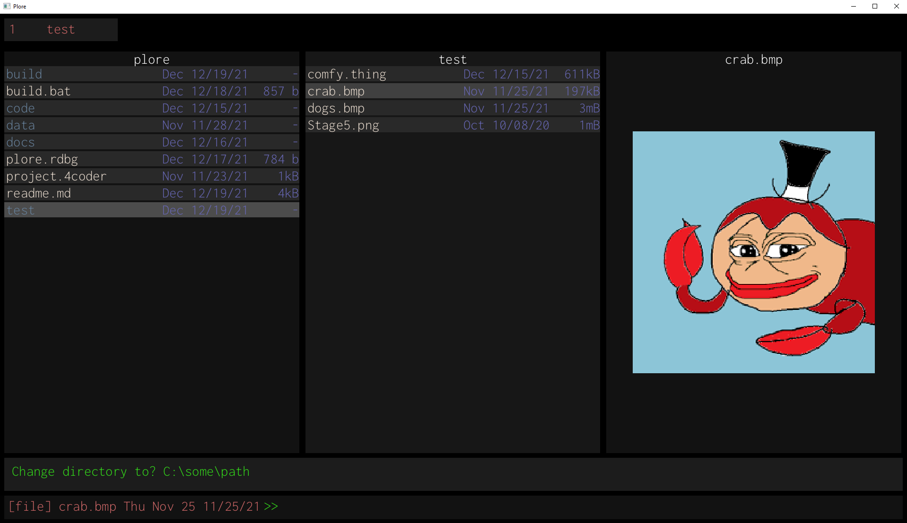

# plore
## Handmade, simple file explorer

Graphical file manager written in C99, with first-class vim bindings. 

Inspired by Ranger and LF, with a design and implementation philosophy focusing on minimizing the number of dependencies, whether they are libraries, programming languages/versions, file encodings, OS-specific logic or otherwise.

## Design Goals
* As simple and minimalistic of an implementation as possible. 
* No complicated build systems, docker containers, or OS abstraction leakage.
* Written in C99, with no dependencies besides the awesome stb header-only libraries.
* Runs as a graphical application, not a terminal application using e.g., ncurses.
* Software designed for personal, cross-platform use on Linux and Windows.
* Potentially hackable by other programmers, via modifying header files.

### Note
Consider this repository to be a snapshot in time of whatever fire I am currently putting out, or feature I am hacking together, rather then a place to propose changes or nitpick very rough (and sometimes outright awful) prototype code.

**I do not attempt to solve problems I do not have**. 

Specifically, there is no handling for:
- Unicode
- Localization
- Terminal integration: I've found colouring and escape sequences alone do not work smoothly between terminal emulators, let alone operating systems.
- xresources integration.
- File previews for every file extension and encoding, e.g., .tiff, .pdf, .gif, etc.
- Variable-length paths: I've never had issues with this before.
- File permission editing: I very rarely do this, at least not often enough to warrant including it in a file manager.

### Warning 
**This is not intended to be used as an everyday file management tool.**.

Hard-crashes and/or debugger traps are used on assertions instead of recovery. As such, release builds are not tested.

There are many degenerate cases that could lead to the loss or corruption of files that haven't been discovered either.

Further, there are some cases that it will probably *never* handle to keep it as simple as possible. 
For example, it is unlikely that I will ever support Unicode paths, as I personally do not have any need for it. Given that I've explicitly recommended others -- who may speak languages other than English -- to not use this tool right now, no harm otherwise done.

### TODOS
* Linux porting.
  For file extensions and shell handlers, this will probably involve a small metaprogram to generate the correct commands.
* Windows layer work - better key handling, for starters.
* Asynchronous file management, for e.g., `mv`s.
* File change notifications, for name changes, time of last edit, photo preview, etc.
* Commands:
   - ~~Change directory~~
   - ~~Rename~~
   - ~~Make directory~~
   - ~~ISearch~~
   - ISearch select numbered candidates
   - ISearch select all candidates
   - ~~File opening preview~~
   - File opening handler suggestion.
   - Open tab in specified directory.
   - ~~Close tab.~~
* Filtering by: Extension, File/Directory/Symlink, Filesize
* Sorting by: Extension, last write date, size
* ~~Command previews~~
* Lister for: Selected files, yanked files, bookmarked directories, commands
* ~~Deletion~~
* ~~User-defined trash~~
* Movement:
- ~~Jump to top/bottom~~
- Paginated movement, i.e. ctrl-u, ctrl-d, and centering.
- ~~Pagination~~
- Smooth scrolling.
* ~~Selecting entries moves the cursor~~
* File preview for formats:
- ~BMP~
- ~PNG~ using stb_image, so does not handle DEFLATE properly!
- ~JPG~
- Text-like files (ASCII only)
* ~~Multiple tabs!~~
* Split tabs!
* ~~Vim commands supporting scalars (e.g., 5yy, 2j)~~
* Clipboard handling.
* ~~Hidden file toggling.~~
* ~~Date display.~~
* ~~Size display.~~
* Undo for: Rename, Paste, Delete (PLORE_TRASH/Recycle Bin only). 
* Persistent: Undo, command history, marked files/directories, bookmarks. Requires plore.history.
* VIMGUI work:
   - ~~Actual alpha blending~~
   - Scissor rects.
   - ~~Z-order~~ Implicit z-ordering using the parent window stack will work ok!
   - Animation.
   - ~Focus~
   - Borders
   - Better primitive lists (curves, stroked lines, bitmaps)
   - Floating windows
   - More widgets: labels, dropdowns, textfields.
   - Bake font into executable.
   - Global font scale.
   - Font colour mask.
* Changing assertions to error codes to prevent crashing when a stabler version is made.
* ... Many more ...

### Building
Currently, there is only a Windows implementation.

Requires Visual Studio 2019 installed to setup MSVC _only_, as there is no `.sln` used to build plore.

Assuming you have Visual Studio 2019's `vcvarsall.bat` installed at `C:\Program Files (x86)\Microsoft Visual Studio\2019\Community\VC\Auxiliary\Build\vcvarsall.bat`...

0. (optional) Tweak the file extension handlers in `plore_file.h` to programs of your choice.
1. Run `build.bat`.
2. Launch the executable from the parent directory of `build`, i.e., `$ build\win32_plore.exe`.

