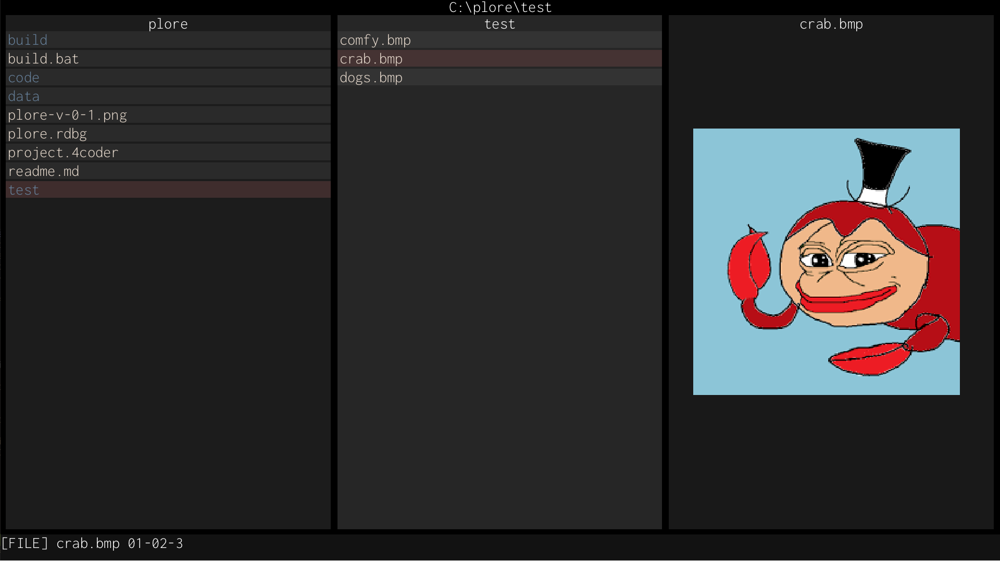

# plore
## Handmade, simple file explorer

Somewhat inspired by Ranger and LF, with a first-class focus on vim bindings and minimizing the number of concepts, libraries or footguns required to use.

### Note
Consider this repository to be a snapshot in time of whatever fire I am currently putting out, or feature I am hacking together, rather then a place to propose changes or nitpick very rough (and sometimes outright awful) prototype code.

### Warning 
**This is not intended to be used as an everyday file management tool.**.
Currently, it does not handle a lot of degenerate cases that could lead to the loss or corruption of files. 
Further, there are some cases that it will probably *never* handle to keep it as simple as possible. 

### TODOS
* Linux port
* Windows layer work (key handling, for starters)
* Asynchronous file management, for e.g., `mv`s.
* Commands:
   - Change directory
   - OS-specific shell
   - Rename
   - Make directory
* Command previews
* Command stack. Sort of implemented, not useful.
* Selecting entries moves the cursor
* File preview - use an extension whitelist. Working for BMP images currently!
* Multiple tabs.
* Vim commands supporting scalars (e.g., 5yy, 2j)
* Per-context cursor and undo stack.
* VIMGUI work:
   - Actual alpha blending 
   - ~~Z-order~~ Implicit z-ordering using the parent window stack will work ok!
   - ~Focus~
   - Better primitive lists (curves, bitmaps)
   - Floating windows
   - More widgets (dropdowns, textfields)
   - Global font scale.
   - Everything could look a lot nicer.
* ... Many more ...

### Building
Currently, only supports Windows. 
Assuming you have Visual Studio 2019;s `vcvarsall.bat` installed at `C:\Program Files (x86)\Microsoft Visual Studio\2019\Community\VC\Auxiliary\Build\vcvarsall.bat`, just run `build.bat`, and everything should just work.
