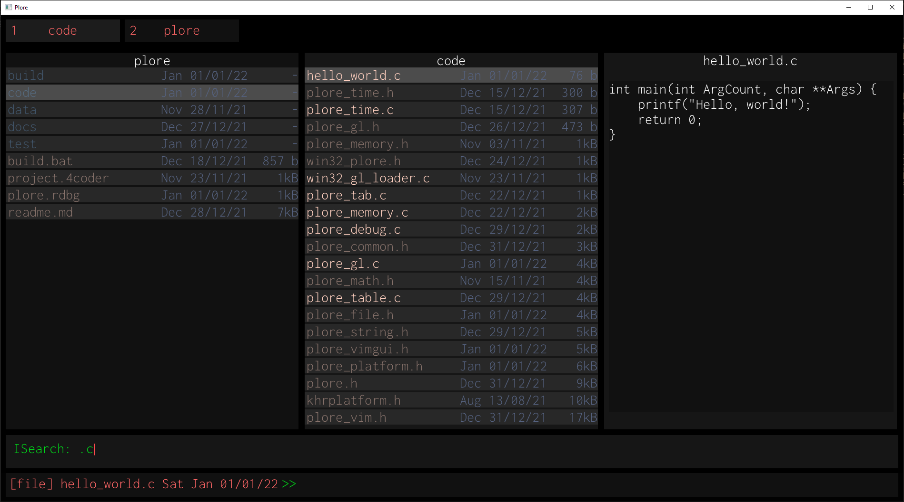

# plore
## Handmade, simple file explorer

Graphical file manager written in C99, with first-class vim bindings. 

Inspired by Ranger and LF, with a design and implementation philosophy focusing on minimizing the number of dependencies, whether they are libraries, programming languages/versions, file encodings, OS-specific logic or otherwise.

## Design Goals
* As simple and minimalistic of an implementation as possible. 
* No complicated build systems, docker containers, or OS abstraction leakage.
* Written in C99, with no dependencies besides the awesome stb header-only libraries.
* Runs as a graphical application, not a terminal application using e.g., ncurses.
* Software designed for personal, cross-platform use on Linux and Windows.
* Potentially hackable by other programmers, via modifying header files.

### Note
Consider this repository to be a snapshot in time of whatever fire I am currently putting out, or feature I am hacking together, rather then a place to propose changes or nitpick very rough (and sometimes outright awful) prototype code.

**I do not attempt to solve problems I do not have**. 

Specifically, there is no handling for:
- Unicode, except where the platform layer requires multi-byte/wide strings.
- Localization.
- Terminal integration: I've found colouring and escape sequences alone do not work smoothly between terminal emulators, let alone operating systems.
- `.xresources` integration.
- File previews (therefore, decoders) for arbitrary file extensions and encodings, e.g., .tiff, .pdf, .gif, etc.
- Variable-length paths: I've never had issues with this on Windows before, nor do I have a need to traverse deeply-nested e.g., `.git` directories, or Python `.env`s.
- File permission editing: I very rarely do this, at least not often enough to warrant including it in a file manager.

### Warning 
**This is not intended to be used as an everyday file management tool.**.

Hard-crashes and/or debugger traps are used on assertions instead of recovery. As such, release builds are not tested.

There are many degenerate cases that could lead to the loss or corruption of files that haven't been discovered either.

Further, there are some cases that it will probably *never* handle to keep it as simple as possible. 
For example, it is unlikely that I will ever support Unicode paths, as I personally do not have any need for it. Given that I've explicitly recommended others -- who may speak languages other than English -- to not use this tool right now, no harm otherwise done.

### Features:
- Fully integrated vim bindings and movement; every action is keyboard-initiated, although some controls can be selected via mouse.
- Basic selection and marking, _a la_ ranger
- Basic file preview for .jpg, .png, .bmp
- Multiple tabs, each with their own state (selection, filter, etc)
- Searching, sorting, filtering

### TODOS
* Linux porting.
  For file extensions and shell handlers, this will probably involve a small metaprogram to generate the correct commands.
* Windows layer work - better key/mouse handling, for starters.
* Asynchronous file management, for e.g., `mv`s.
* File change notifications, for name changes, time of last edit, photo preview, etc.
* Commands:
   - ~~Basic vim movement (hjkl) for directory traversal.
   - ~~Moving 'into' a file opens the default extension handler.~~
   - ~~Scalar vim movement~~
   - ~~Interactive change directory~~
   - ~~Interactive delete with confirmation~~
   - ~~User-defined trash location~~
   - ~~Interactive rename~~
   - ~~Interactive rename~~
   - ~~Select file/s~~, ~~Select entire directory~~, Scalar select, Clear selection
   - ~~Yank~~, ~~Yank entire directory~~, ~~Yank selection~~, ~~Clear Yank~~, ~~Scalar yank~~
   - ~~Paste~~
   - ~~Interactive make directory~~
   - ~~Interactive make file~~
   - ISearch: ~~Jump to result on return~~, navigate between results (n/p)
   - ~~Open file, from list of candidate extension handlers~~
   - Tabs: ~~create tab~~, ~~close tab~~, create tab in specified directory
   - ~~Toggle hidden file display~~
   - ~~Sorting by various file metadata~~
   - ~~Filter any files matching substring~~
   - ~~Interactive open file, using user-specified shell.~~
   - Lister navigation: Select numbered item (ctrl+number), ISearch
   - ~~File opening handler suggestion.~~
   - ~~Close tab.~~
   - ~~Command lister.~~

### File Management TODOs:
- Filtering by: ~~Filename~~, ~~Extension~~, File/Directory/Symlink
- ~~Global tab filtering~~
- ~~Per-directory filtering~~
- Sorting by: ~~Extension~~, ~~last write date~~, ~~size~~
- Lister for: Selected files, yanked files, bookmarked directories, ~~commands~~
- Paginated movement, i.e. ctrl-u, ctrl-d, and centering.
- Smooth scrolling - maybe.
- Robust photo preview - BMP doesn't handle top-to-bottom, stb_image doesn't handle DEFLATE. _Probably_ `libpng` and/or `libjpg`.
- ~~Text-like ASCII file preview~~
- Split tabs.
- Clipboard handling.
- Undo for: Rename, Paste, Delete (PLORE_TRASH/Recycle Bin only). 
- Persistent: Undo, command history, marked files/directories, bookmarks. Requires plore.history.
- Track: File ownership (not POSIX, but probably "owned by current user, system, or other")
- Recursive ISearch.
- Track/calculate: Directory cumulative size.
- CursorInfo: Display cumulative size and number of files

### VIMGUI TODOs:
   - ~~Actual alpha blending~~
   - Scissor rects.
   - ~~Z-order~~ Implicit z-ordering using the parent window stack will work ok!
   - Animation.
   - ~Focus~
   - Borders
   - Better primitive lists (curves, stroked lines, bitmaps)
   - Floating windows
   - More widgets: labels, dropdowns, textfields.
   - Bake font into executable.
   - Global font scale.
   - Font colour mask.

### Robustness TODOs:
* Changing assertions to error codes to prevent crashing when a stabler version is made.
* ... Many more ...

### Building
Currently, there is only a Windows implementation.

Requires Visual Studio 2019 installed to setup MSVC _only_. There is no `.sln` used to build plore.

Assuming you have Visual Studio 2019's `vcvarsall.bat` installed at `C:\Program Files (x86)\Microsoft Visual Studio\2019\Community\VC\Auxiliary\Build\vcvarsall.bat`...

0. (optional) Tweak the file extension handlers in `plore_file.h` to programs of your choice.
1. Run `build.bat`.
2. Launch the executable from the parent directory of `build`, i.e., `$ build\win32_plore.exe`.

There is currently no discovery of the executable's runtime location, so make sure to run it from the parent of `build`.

### "Documentation"/notes
The codebase is scattered with comments where they are useful. 
Most paradigms, memory lifetimes, and examples for extension would be self-explanatory, albeit some important ones are not documented, such as the command key interpreter. 

I would suggest to ignore the murky parts until they are fixed, as I am not interested whatsoever in "cleaning up" or documenting working (but messy) code when there's a lot of features and polish I would rather do. 

I am happy to explain any part of the codebase, though, and conversation in general is welcome.

Basic "user" documentation exists in the form of `plore_vim.h`, where all the commands and bindings are specified.

Eventually, a small metaprogram will generate information currently maintained in the X macros, along with similar occurences with `plore_file` extension handlers and `plore_vimgui` skinning.